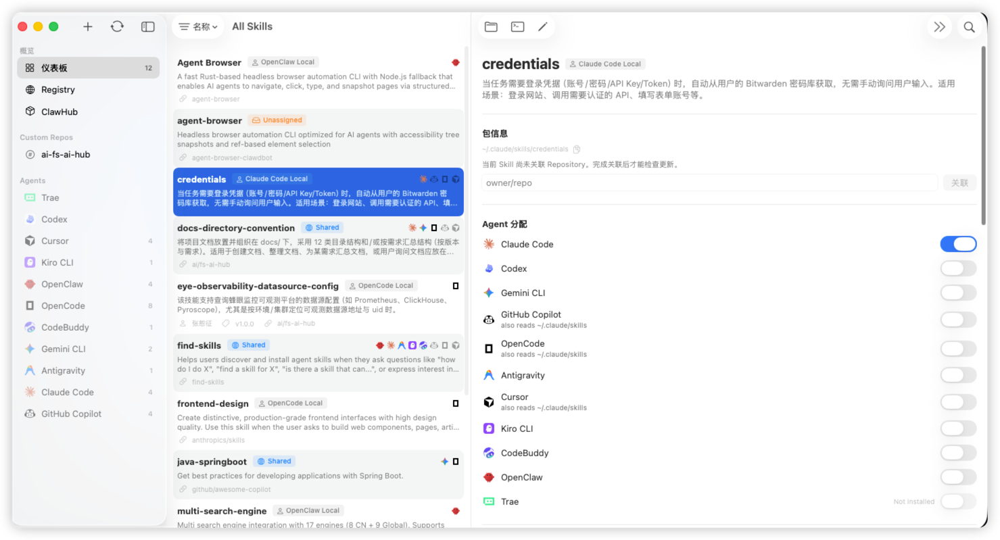
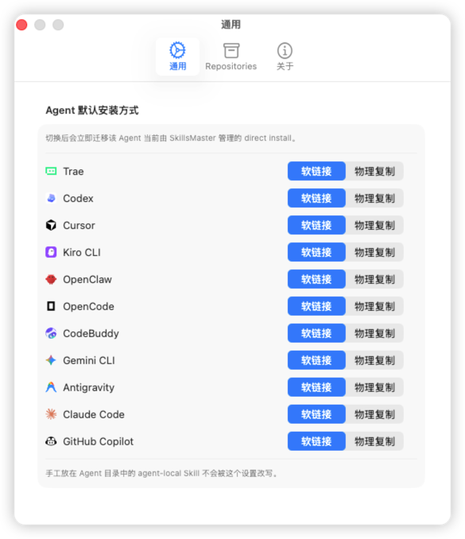
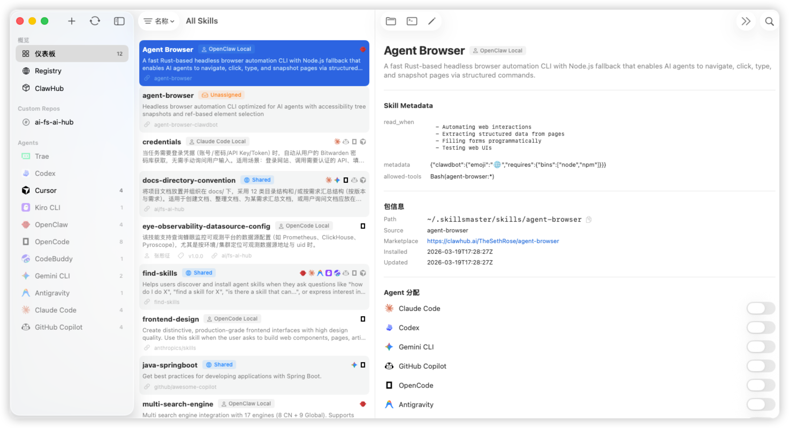
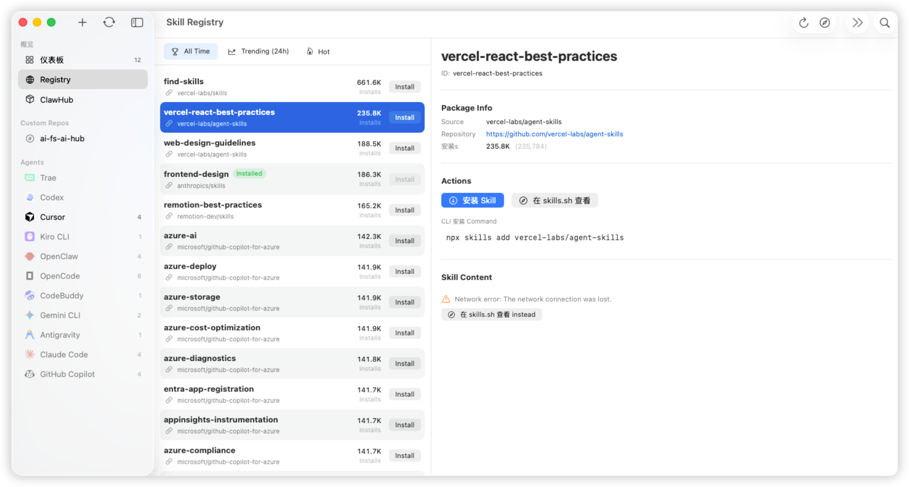
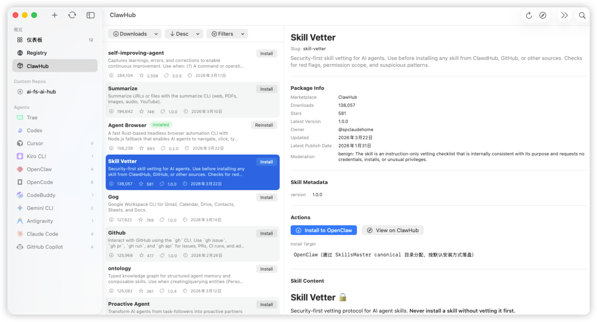
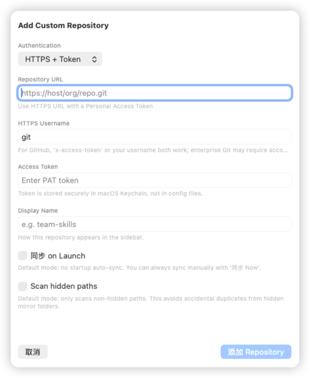
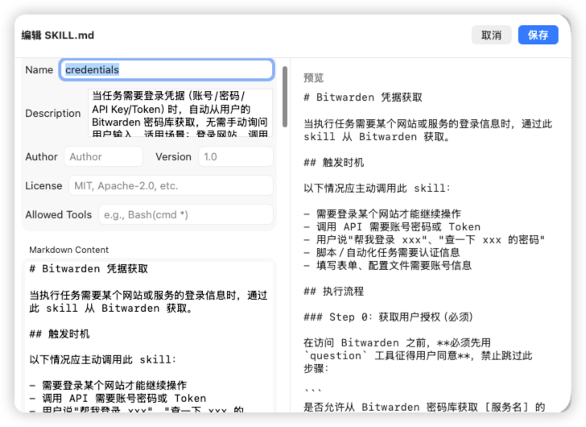

# SkillsMaster

SkillsMaster 是一个面向 macOS 的原生应用，用统一的图形界面管理多种 AI 编程代理的 Skills 与 Agent 根目录文件。当前仓库围绕真实实现持续维护以下链路：本地扫描、Agent 分配、Agent Files 浏览、内置文本编辑、外置编辑器 / 默认终端配置、更新检查、Skills.sh / ClawHub / Custom Repository 安装，以及测试、打包、Release、Homebrew 分发。

> 项目来源：本仓库源自 fork [crossoverJie/SkillDeck](https://github.com/crossoverJie/SkillDeck.git)，当前以 `SkillsMaster` 为产品名持续演进和维护。

## 它解决什么问题

如果你同时使用多个 AI 编程代理，通常会遇到这些问题：

- Skills 分散在不同目录，难以统一查看
- `SKILL.md` 需要手工维护，Frontmatter 和 Markdown 容易出错
- symbolic link / physical copy、lock file、来源仓库和更新状态难以追踪
- 不同 Agent 之间存在继承读取规则，是否“真的安装到该 Agent”不容易判断
- 想从 Skills.sh、GitHub 仓库、ClawHub 或自定义仓库安装 Skill 时，缺少统一入口

SkillsMaster 的目标，是把这些分散在文件系统、命令行和配置文件里的操作，收敛到一个原生 macOS UI 里完成。

## 当前已实现

- 自动检测本机 Agent，并扫描 `~/.skillsmaster/skills`、各 Agent 目录以及兼容目录中的 Skills
- 统一展示 direct install 与 inherited install，并支持按 Agent 过滤查看
- `Installed > All Skills` 页面支持搜索、排序、删除，以及在 Finder / Terminal 中打开 Skill；右侧详情保留完整管理能力
- 支持在 Sidebar 中按 `Installed / Marketplace / Repositories / Agents` 分组导航；`Agents > Agent Files` 仅对已安装或已有配置目录的 Agent 显示，`Agents > Agents Skills` 的详情页只读显示 Skill 标题、描述、Metadata 与 Markdown 正文
- `Agent Files` 支持浏览 Agent 配置根目录，默认显示隐藏文件，并支持新建文件、新建文件夹、重命名、删除
- `Agent Files` 中点击 `.md`、`.json`、`.toml`、`.txt`、`.yaml`、`.yml`、`.log` 等文本文件时，会先在右侧 detail pane 直接预览内容；其中 Markdown 走原生渲染，其余文本走等宽代码块预览，并保留单独的编辑入口
- `Agent Files` 的文本预览超过 10 MB 时会回退为原始文本预览，不再执行 Markdown 渲染或结构化格式化
- `Agent Files` 中可配置全局外置编辑器和全局默认终端，并支持在 Finder / 外置编辑器 / 终端中打开当前文件或目录
- `Agent Files` 中的 `skills/` 目录及其子内容只读显示，不允许新建、重命名、删除或外部编辑
- 详情页支持查看 Frontmatter、Markdown 正文、lock file 信息和更新状态
- `Skill Detail` 中的 `SKILL.md` 编辑已统一为右侧 detail pane 纯文本编辑器
- 可为每个 Agent 单独设置默认安装方式：`symbolic link` 或 `physical copy`
- 从 GitHub 仓库扫描并安装 Skills，安装后落到 canonical 目录并写入 lock file
- 浏览并安装 `Skills.sh` 中的 Skills
- 浏览 ClawHub marketplace，查看详情、读取 `SKILL.md`，并安装到 OpenClaw
- 管理 GitHub / GitLab Custom Repository，支持 `SSH` 和 `HTTPS + Token`
- Custom Repository 支持 clone / pull、轻量索引缓存、按需加载详情和本地安装
- 支持为未记录来源的本地 Skill 手动关联 Repository，随后执行更新检查
- 支持批量检查 Git 来源 Skill 更新，并记录本地 / 远端 commit hash
- 启动时执行从 `~/.agents` 到 `~/.skillsmaster` 的迁移，并保留对旧兼容路径的读取
- 文件系统变化会触发自动刷新，尽量让 UI 与磁盘状态保持同步
- 支持主题切换、应用版本检查、自更新入口、测试、打包、GitHub Release 和 Homebrew cask 链路

## 支持的 Agents

当前代码中已支持以下 Agent 类型：

- Claude Code
- Codex
- Gemini CLI
- GitHub Copilot
- OpenCode
- Antigravity
- Cursor
- Kiro CLI
- CodeBuddy
- OpenClaw
- Trae

## 来源与存储约定

- canonical Skills 目录：`~/.skillsmaster/skills`
- lock file：`~/.agents/.skill-lock.json`
- Custom Repository clone / cache 目录：`~/.skillsmaster/repos`
- Custom Repository 配置：`~/.skillsmaster/.skillsmaster-repos.json`

需要注意的用户可见约定：

- `~/.skillsmaster/skills` 是 SkillsMaster 维护的事实源目录
- Agent 目录中的 direct install 会按默认安装方式落为 symbolic link 或 physical copy
- `Agent Files` 的根目录来自各 Agent 的配置目录，例如 `~/.codex`、`~/.claude`、`~/.gemini`
- `Agent Files` 中的 `skills/` 是受保护路径，只允许浏览与跳转，不允许直接改写
- 外置编辑器是全局设置；未配置时回退到系统默认应用
- 默认终端是全局设置；当前支持 Terminal / iTerm / Warp / Ghostty，未配置时回退到 Terminal
- `~/.agents/.skill-lock.json` 仍保留在旧位置，以兼容外部工具
- Custom Repository 的本地 clone 目录是 SkillsMaster 管理的 cache，不是推荐的手工编辑工作区
- 当前 ClawHub 入口明确面向 OpenClaw，不是面向所有 Agent 的通用 marketplace 安装入口

## 当前边界

以下方向在当前仓库中还没有完整交付，不应当视为已支持：

- Project-level Skills 管理
- Create Skill Wizard / 模板化创建流程
- 更深入的批量操作能力
- 语法高亮、LSP、diff-aware 的高级代码编辑体验
- 完整的签名、公证、DMG 分发体验

## 环境要求

- macOS 14+
- Xcode 15+
- Swift 5.9+

## 快速开始

### 从源码运行

```bash
git clone https://github.com/zhls-ayl/SkillsMaster.git
cd SkillsMaster
./run
```

### 运行测试

```bash
./run test
```

### 打包应用

```bash
./run package --version 1.2.3 --zip
```

### 发布版本

```bash
./run release v1.2.3
```

## 常用命令

`./run` 是仓库统一入口。无参数时默认等价于 `./run dev`，并会把 Swift / clang module cache 固定到仓库内 `.build/`，降低路径迁移和系统缓存造成的问题。

```bash
./run help
./run dev
./run test --filter SkillMDParserTests
./run build -c release
./run clean
./run package --version 1.2.3 --zip
./run release v1.2.3
```

## 界面预览

### Repositories 浏览页



### Agent 默认安装方式设置



### All Skills



### Skills.sh 浏览页



### ClawHub 浏览页



### Repository 设置页



### 内置文本编辑器



## 文档入口

- [`README.md`](README.md)：项目概览、适用人群、快速开始、界面预览
- [`docs/Index.md`](docs/Index.md)：文档导航、阅读顺序、更新落点
- [`AGENTS.md`](AGENTS.md)：仓库协作原则、确认边界、验证要求、高风险改动规则

如果你准备继续理解实现，建议从 [`docs/architecture.md`](docs/architecture.md) 开始；如果你准备参与开发或改动发布链路，再继续阅读 [`docs/development.md`](docs/development.md) 和 [`docs/release.md`](docs/release.md)。

## 仓库结构

- `Sources/SkillsMaster/`：SwiftUI + MVVM 应用源码
- `Tests/SkillsMasterTests/`：单元测试
- `scripts/`：本地运行、打包、Release 脚本
- `docs/`：架构、开发、发布、能力边界文档
- `.github/workflows/`：CI / Release workflow
- `homebrew/skillsmaster.rb`：Homebrew cask 模板

## 相关说明

- 单元测试当前覆盖 parser、Git、lock file、symlink、repository cache、ViewModel 等关键模块
- 修改用户可见行为、路径约定、脚本入口或发布方式时，应同步更新 `README.md`、相关专题文档和必要测试
