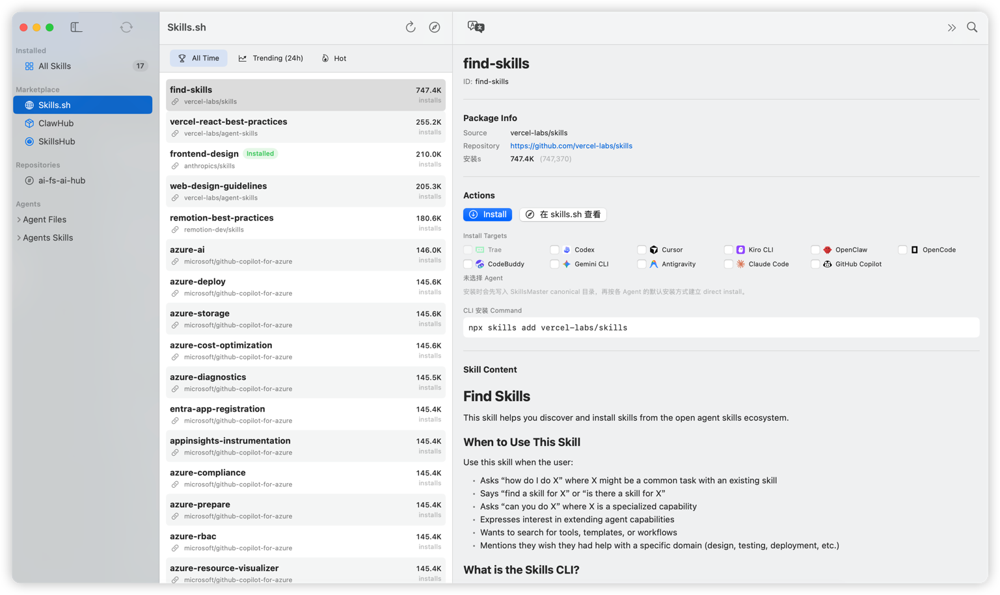
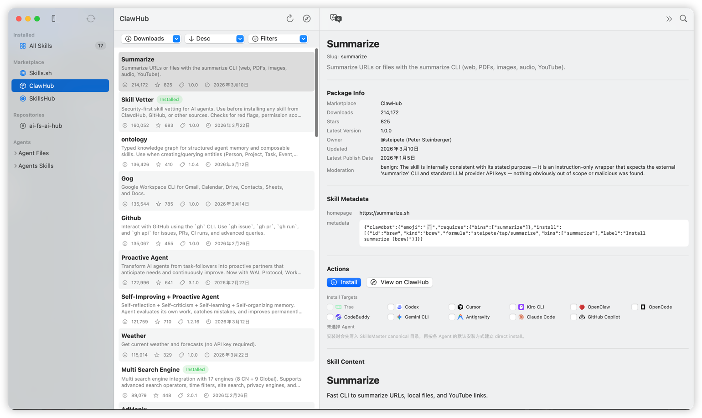
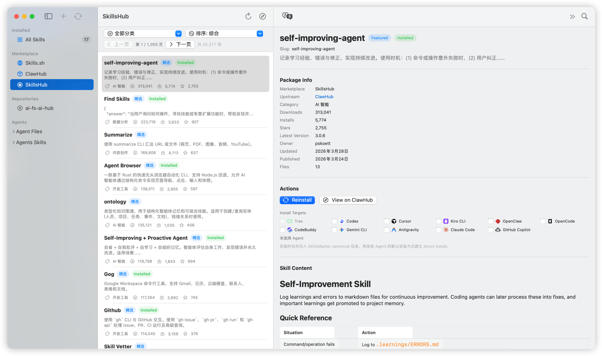
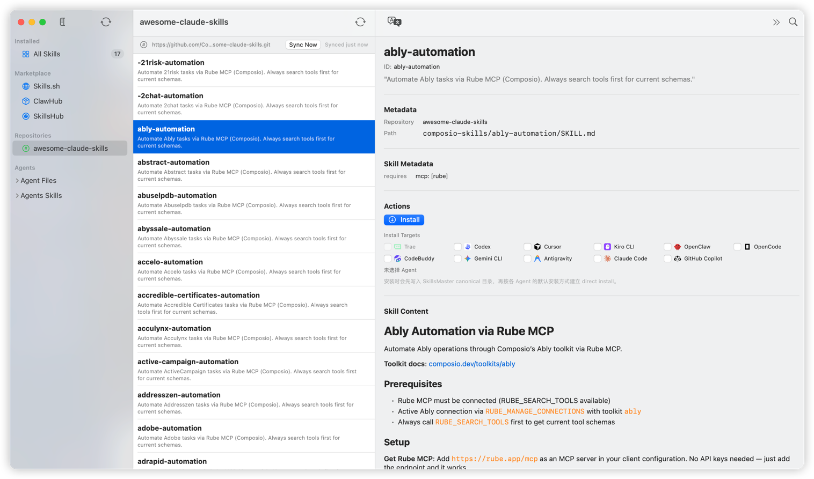
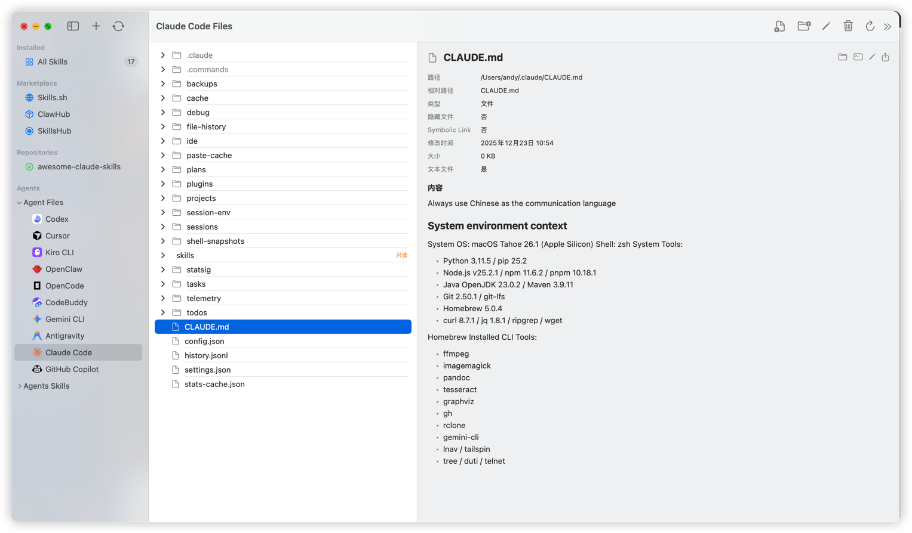
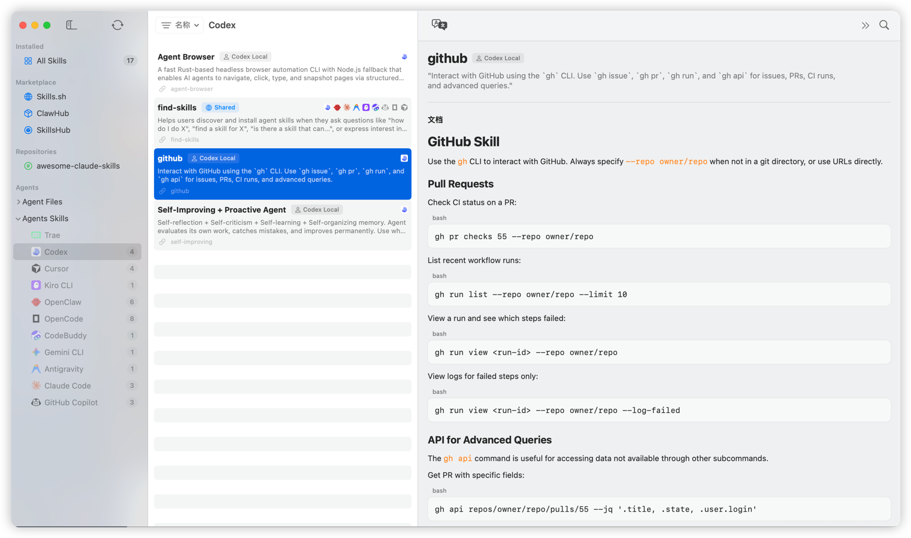

# SkillsMaster

[English](README.md) | 简体中文

SkillsMaster 是一个面向 macOS 的原生应用，用统一的图形界面管理多种 AI 编程代理的 Skills 与 Agent 根目录文件。它把原本分散在文件系统、symbolic link、lock file、Git 仓库和 marketplace 里的操作，收敛到一个桌面应用里完成。

> 项目来源：本仓库源自 fork [crossoverJie/SkillDeck](https://github.com/crossoverJie/SkillDeck.git)，当前以 `SkillsMaster` 为产品名持续演进和维护。

## 为什么用它

如果你同时使用多个 AI 编程代理，通常会遇到这些问题：

- Skills 分散在不同目录，难以统一查看和管理
- `SKILL.md`、Frontmatter、来源仓库和安装状态不容易追踪
- 不同 Agent 存在继承读取规则，是否真的安装到目标 Agent 不直观
- 想从 `Skills.sh`、ClawHub、SkillsHub 或自定义仓库安装 Skill 时，入口和体验不统一
- 手动维护 symbolic link / physical copy、更新检查和 lock file 成本高

SkillsMaster 的目标就是把这些操作变成一套一致的本地图形界面。

## 核心能力

- 统一扫描和展示本地 Skills，区分 direct install 与 inherited install
- 在 `Installed > All Skills` 中搜索、排序、删除、编辑、重新分配 Agent，并检查更新
- 提供 `Agent Files` 视图浏览各 Agent 配置目录，支持文本预览、内置编辑、Finder/终端/外部编辑器跳转
- 支持为每个 Agent 单独设置默认安装方式：`symbolic link` 或 `physical copy`
- 支持从 Git 仓库、`Skills.sh`、ClawHub、SkillsHub 与 Custom Repository 安装 Skills
- 支持批量检查 Git 来源与 SkillsHub 来源 Skill 更新
- 支持应用自更新，并优先使用 GitHub Release 中的 `universal.zip`
- 支持 GitHub Release 多产物分发：`universal.zip`、`arm64.zip`、`x86_64.zip`、`universal.dmg`
- 支持完整 UI 国际化：当前提供 `English + 简体中文`，默认跟随系统语言，并允许在 Settings 中手动覆盖

## 安装

### Homebrew

推荐通过 Homebrew 安装：

```bash
brew tap zhls-ayl/skillsmaster
brew install --cask skillsmaster
```

### GitHub Release

也可以直接从 GitHub Release 下载：

- `SkillsMaster-v<version>-universal.zip`
- `SkillsMaster-v<version>-arm64.zip`
- `SkillsMaster-v<version>-x86_64.zip`
- `SkillsMaster-v<version>-universal.dmg`

Release 页面：

- [GitHub Releases](https://github.com/zhls-ayl/SkillsMaster/releases)

### 从源码运行

```bash
git clone https://github.com/zhls-ayl/SkillsMaster.git
cd SkillsMaster
./run
```

## 环境要求

- macOS 14+
- Xcode 15+
- Swift 5.9+

如果你希望使用详情页内联中文翻译能力，还需要：

- macOS 26+
- 系统已安装 English -> Simplified Chinese 离线翻译语言包

## 支持的 Agents

- Claude Code
- Codex
- Gemini CLI
- GitHub Copilot
- OpenCode
- Antigravity
- Cursor
- Kiro CLI
- CodeBuddy
- OpenClaw
- Trae

## 使用方式概览

- `Installed`：查看、编辑、分配、删除、检查更新本地已安装 Skills
- `Marketplace`：从 `Skills.sh`、ClawHub、SkillsHub 浏览并安装 Skills
- `Repositories`：接入 GitHub / GitLab Custom Repository 并按仓库同步、浏览、安装
- `Agents`：浏览每个 Agent 的 Skills 和配置目录文件

## 用户需要知道的约定

- SkillsMaster 维护的 canonical Skills 目录是 `~/.skillsmaster/skills`
- 兼容外部工具的 lock file 仍位于 `~/.agents/.skill-lock.json`
- `Agent Files` 中的 `skills/` 是受保护路径，只允许浏览和跳转，不允许直接改写
- 应用内更新依赖当前运行实例对应的 `.app` bundle；从 `swift run`、DMG 或临时解压位置启动时，不保证可原地更新

## 界面预览

### All Skills


### Skill 详情页


### Skills.sh



### ClawHub



### SkillsHub



### Repositories



### Agent Files



### Agent Skills



## 常用命令

`./run` 是仓库统一入口。无参数时默认等价于 `./run dev`。

```bash
./run
./run test
./run build -c release
./run package --version 1.2.3 --release-assets
./run release v1.2.3 --remote zhls-ayl --yes
```

## 文档入口

- [`README.md`](README.md)：英文项目概览、安装方式、能力摘要、界面预览
- [`README.zh-Hans.md`](README.zh-Hans.md)：中文项目概览、安装方式、能力摘要、界面预览
- [`docs/Index.md`](docs/Index.md)：文档导航、阅读顺序、更新落点
- [`docs/architecture.md`](docs/architecture.md)：核心实现结构、路径约定、更新与安装链路
- [`docs/development.md`](docs/development.md)：开发工作流、测试与验证方式
- [`docs/release.md`](docs/release.md)：打包、Release、Homebrew tap 与发布检查清单
- [`AGENTS.md`](AGENTS.md)：仓库协作规则、确认边界、验证要求、高风险改动规则
